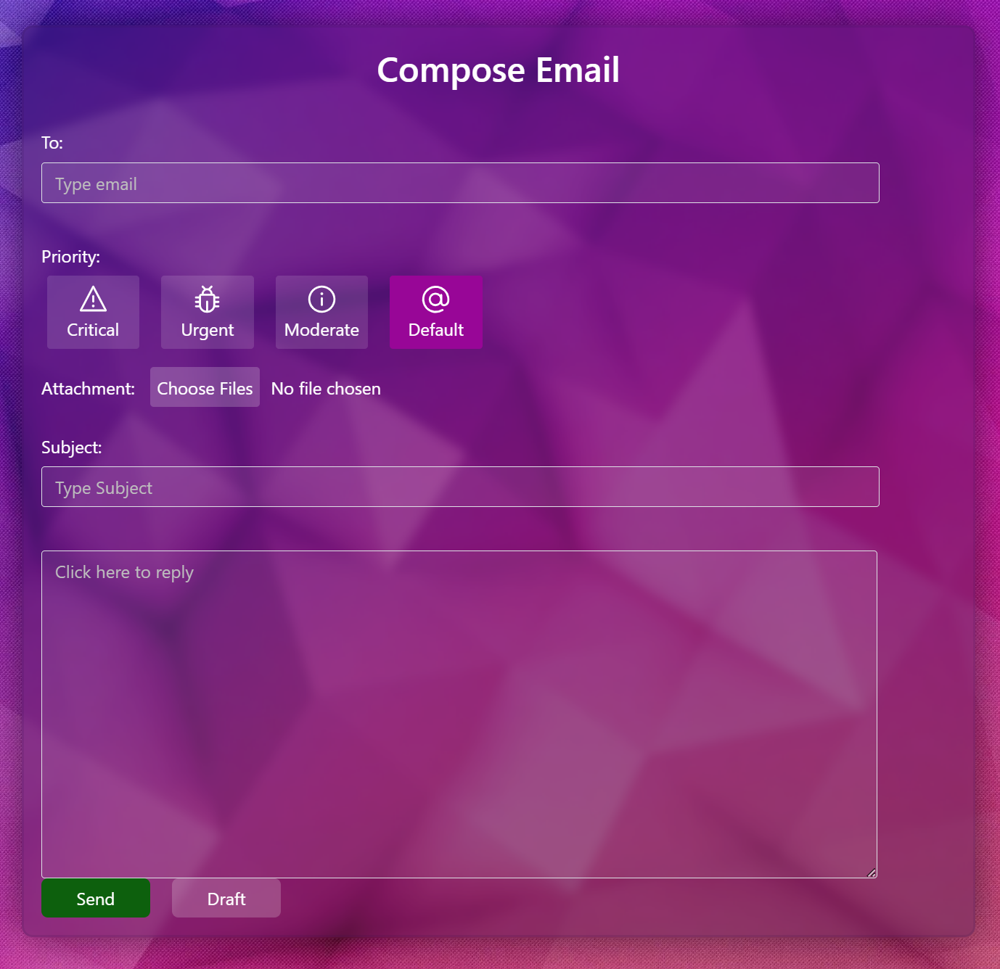

# Berry Mail
## Contributers:
-  [Armaritto](https://github.com/Armaritto)
-  [SantiagoMontag](https://github.com/SantiagoMontag)
-  [Karene-Antoine](https://github.com/Karene-Antoine)
-  [AndrewAchraf](https://github.com/AndrewAchraf)
---
## Frameworks and technology used:
- For the frontend part (view part), we used HTML, CSS, and Javascript through vue framework.
- For the backend (model and controller), we used Java language through springboot framework.
---
## How to run:
#### Back-end part:
- Head to the backend directory which is found in the following directory ```.\BerryMail\src\main\java\com.berrymail\BerryMailtApplication```
- Run the spring boot application
- Note that backend will be running at ```localhost:8080```
#### Front-end part:
- Head to the frontend directory which is found in ```.\BerryMail\src\frontend``` and run ```npm run serve``` in terminal
- Launch any browser and open ```localhost:3000/login```
- EEnjoy using the BerryMail web application.
---
## Design Pattern used:
#### Builder Design Pattern:
- Used to create an object of type User and type Mail with different number of attributes .
#### Singleton Design Pattern:
- Used in order to make sure that there exists only one instance of the user .
#### Mediator Design Pattern:
- Used to reduce dependencies between objects and restricts direct communications between these objects and forces them to collaborate only via a mediator object (User Service has the ability to communicate with Mail Service) .
#### Filter Design Pattern:
-  Used simply to implement features of each type of filter .
#### Factory Design Pattern:
-  Used to make factory for the filter criterias. The Filter Factory class creates an instance of any filter by using a key string which is the name of the desired filter to be formed .
---
## Enjoy your Berries 🍒📧

